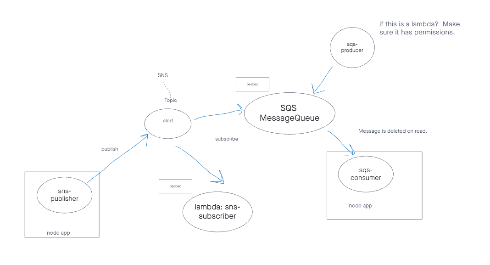

# caps-cloud

## Overview

This project is an introduction to AWS SNS and SQS services. The SNS is a notification system that publishes a "pickup" topic. The SQS subcribes to the SNS and stores the event so that we can had another "driver" client subscribe to the SQS as a "Consumer".

## Documentation

